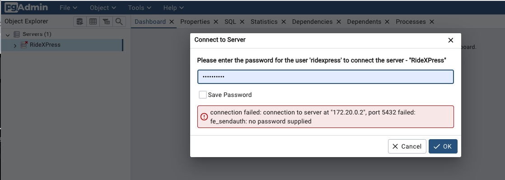
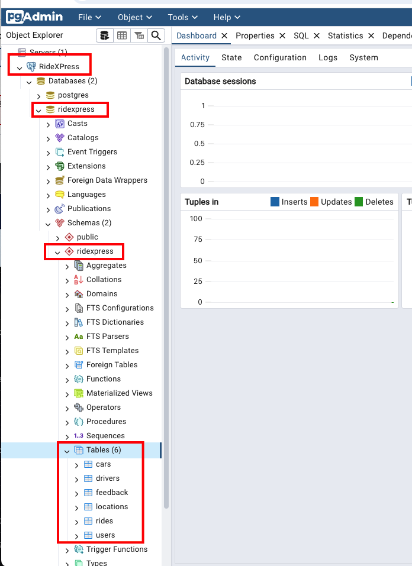
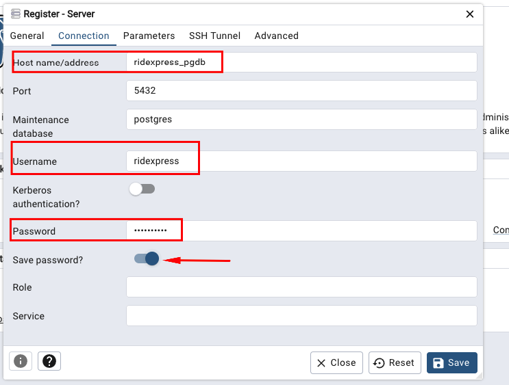

# Database Docker Setup

This README provides instructions on how to set up and run the database using Docker.

## Prerequisites

- Docker installed on your machine
- Docker Compose 

## Files in this directory

- `docker-compose.yml`: Defines the services, networks, and volumes for Docker Compose.
- `initdb/init.sql`: Contains the initial SQL commands to set up the database schema and populate it with initial data. This file is executed when the Docker container is started, ensuring that the database is ready to use with the necessary tables and data.


## Starting the Docker Compose

To start the Docker compose images, navigate to this directory and run the following command:

```sh
docker-compose up
```
Note: Both containers can be accessed from the local machine using localhost.
- DB: 
    - host: localhost
    - port: 5432
- PGAdmin:  
    - host: localhost
    - port: 8888

## Access to db server in PGAdmin

1. Open the browser in the following url : `http://localhost:8888/login`

1. Use the credentials in the docker-compose.yml file
1. Expand servers and click on RideXPress : `http://localhost:8888/login`

1. Add the credential and click Save password
1. Browse to access the tables



## Create a new db server in PGAdmin


1. Open the browser in the following url : `http://localhost:8888/login`

1. Use the credentials in the docker-compose.yml file
1. Right Click on "Add New Server".
    
1. In the "General" tab, enter a name for the server.
        
1. Navigate to the "Connection" tab.
    
1. Enter the following details:
    - Host name/address: `ridexpress_pgdb`
    - Port: `5432`
    - Username: `ridexpress`
    - Password: `ridexpress`
    - Save password?: `true`
1. Click "Save" to register the server.

